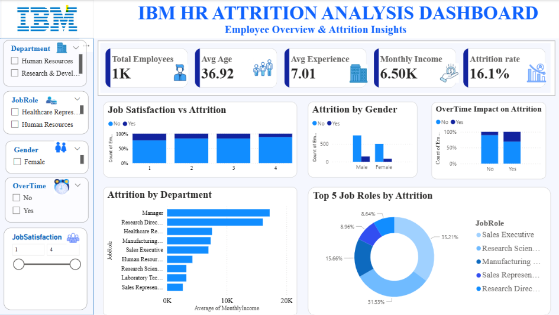

# IBM HR Attrition Analysis Dashboard

## Project Overview
This project is an interactive Power BI dashboard developed using the IBM HR Analytics dataset to analyze employee attrition trends and workforce insights.

## Tools & Technologies
- Power BI
- DAX
- Data Visualization
- Interactive Slicers
- KPI Cards

## Dashboard Features
- Employee Attrition Analysis
- Attrition Rate KPI
- Department-wise Attrition
- Gender-based Attrition Insights
- Overtime Impact Analysis
- Job Satisfaction Analysis
- Interactive Filters & Slicers

## Dashboard Preview

